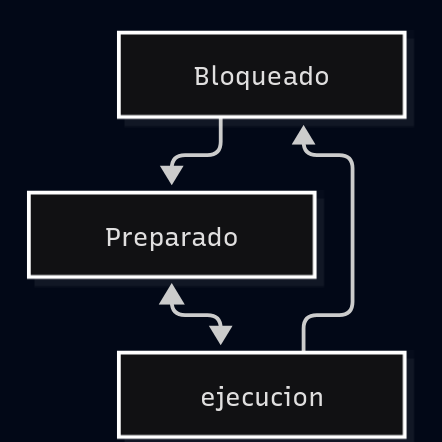
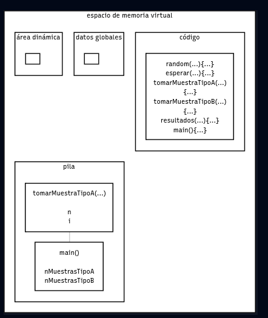

# Concepto de Proceso

Un proceso es un conjunto de instrucciones que cumplen una función pero a diferencia de un programa el proceso ejecuta recursos del sistema y el estado en ejecución.
un proceso contiene:

* su propio espacio de direcciones de memoria,
* sus variables,
* ficheros abiertos,
* referencias a procesos hijo,
* contador de programa,
* registros,
* pila,
* elementos de sincronismo

Un proceso puede estar en:

* ejecución : esta utilizando la UCP
* preparado : esta detenido temporalmente para que se ejecute otro proceso
* bloqueado : el proceso esta esperando que ocurra algo para continuar

## Esquema del espacio de memoria virtual.

* Pila: area de memoria donde se mantienen las variables automáticas y la información necesaria para continuar con la función que se esta ejecutando.

* Código: area de memoria donde se mantiene el código del programa.

* Datos globales : area de memoria donde se mantienen los datos globales.

* Area dinámica:area de memoria para asignación dinámica.

